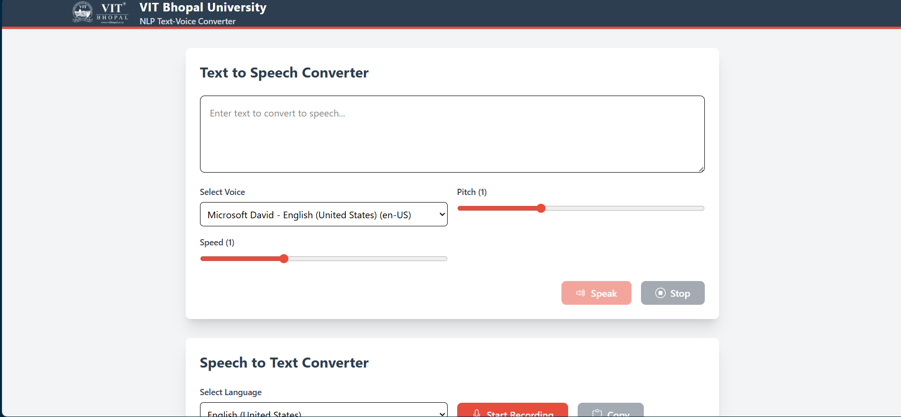

# 🎙️ VoiceText Converter

A **web application** for seamless bidirectional conversion between **text and speech**, developed as part of the **NLP course at VIT Bhopal University**.

  


---

## 📌 Features

### 🗣️ Text-to-Speech (TTS)
- Convert text into natural-sounding audio
- Customizable voice parameters:
  - Pitch control: `0.5 - 2.0`
  - Speed control: `0.5 - 2.0`
  - Multiple voice options
- Real-time playback control
- Works across major browsers

### 🎧 Speech-to-Text (STT)
- Real-time speech recognition
- Multi-language support (EN, HI, ES, FR)
- Continuous listening mode
- Auto punctuation and clipboard copy
- Interactive transcript display

---

## 🛠️ Tech Stack

### Frontend
- **React** (v18+)
- **Vite** (v4+)
- **Tailwind CSS** (v3+)
- **Web Speech API**
- **React Bootstrap**
- **React Icons**

### Development Tools
- **npm**
- **ESLint**
- **Prettier**
- **Git**

### Key Dependencies
- `react-toastify`
- `web-speech-api` (polyfill)
- `react-bootstrap-icons`

---

## 🚀 Installation & Local Setup

### ✅ Prerequisites
- Node.js (v16+)
- npm (v8+)
- Modern browser (Chrome 88+ / Edge 89+)

### 🔧 Steps

```bash
# Clone the repository
git clone https://github.com/yourusername/voice-text-converter.git
cd voice-text-converter

# Install dependencies
npm install

# Set up environment
cp .env.example .env
```

### 🧪 Running the Project

**Development Mode:**
```bash
npm run dev
```

**Production Build:**
```bash
npm run build
```

**Preview Production Build:**
```bash
npm run preview
```

---

## 📁 Project Structure

```
voice-nlp-converter/
├── public/
│   └── vit-logo.png           # University branding
│
├── src/
│   ├── components/            # UI Components
│   │   ├── Header/
│   │   ├── Footer/
│   │   ├── TextToSpeech/
│   │   └── SpeechToText/
│   │
│   ├── hooks/                 # Custom React hooks
│   │   ├── useSpeechSynthesis.js
│   │   └── useSpeechRecognition.js
│   │
│   ├── assets/
│   │   └── styles/            # Tailwind / CSS
│   │
│   ├── App.jsx                # Root component
│   └── main.jsx               # Entry point
│
├── .gitignore
├── index.html
├── package.json
├── tailwind.config.js
└── vite.config.js
```

---

## 🧠 Implementation Details

### Core Technologies
- **Web Speech API**
  - `SpeechSynthesis` for TTS
  - `SpeechRecognition` for STT
  - BCP-47 language code support
  - Browser-native and performant

### State Management
- React `useState` and `useEffect`
- Component-level state handling
- Support for async processes

### UI/UX Enhancements
- Fully responsive layout
- VIT-branded color palette
- ARIA accessibility labels
- Loading & error states
- Cross-device compatibility
- Interactive controls & animations

---

## 🧩 Key Components

### 🎤 Voice Synthesis
- Dynamic voice list
- Audio tuning (pitch/speed)
- Browser compatibility fallback

### 📝 Speech Recognition
- Continuous listening
- Live transcript update
- Microphone permission checks
- Graceful error handling